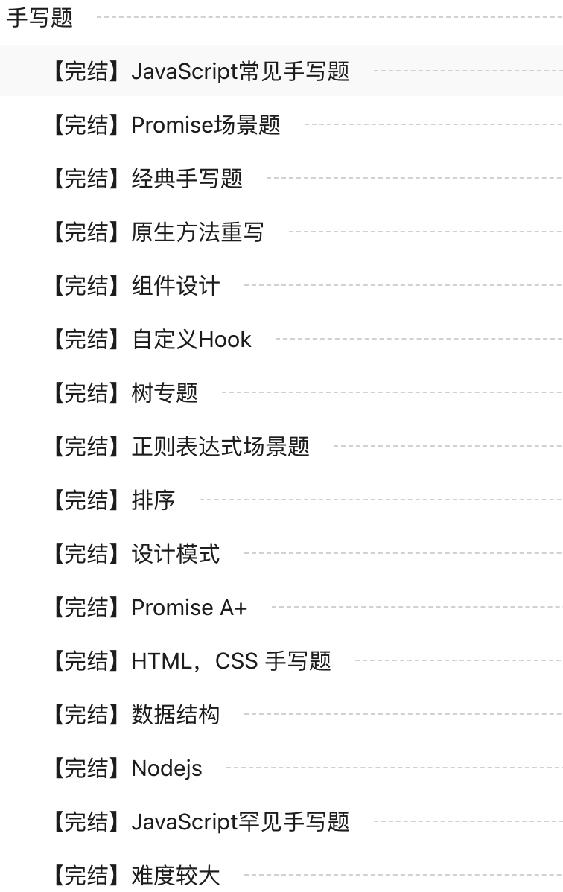
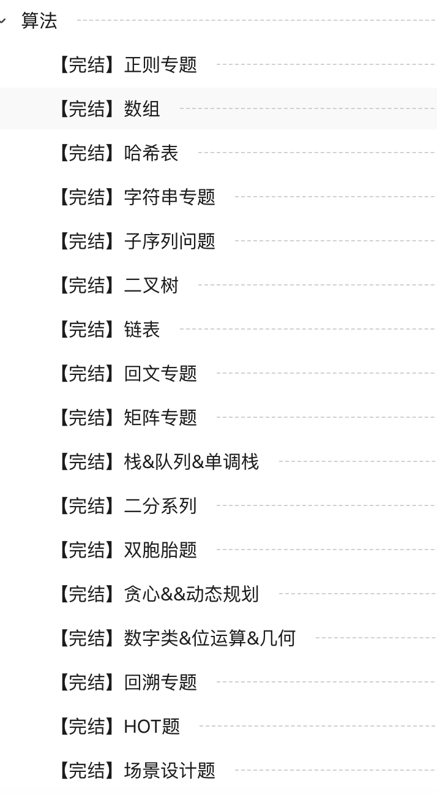

<h1 align="center">Welcome to js-challenges 👋</h1>
<h1 align="center">
  </img>
</h1>

  
  
  
  

> 集锦大厂面试常考的 前端手写题和 leetcode 算法题

### 🏠 [DOCS](https://sunny-117.github.io/js-challenges/)

## Author

👤 **sunny-117**

- Website: https://sunny-117.github.io/blog/
- Twitter: [@zhiqiangfu6sun](https://twitter.com/zhiqiangfu6sun)
- Github: [@sunny-117](https://github.com/sunny-117)
- personal share: [个人分享](https://jzq422bol5.feishu.cn/docx/doxcnyogD4POabvLHoa1yoEH9W0)

# CONTENT

前端手写题集锦 记录大厂**笔试，面试常考**手写题，2022 年前端面试中常见的 leetcode 算法题, 致力打造最全的前端 JavaScript 手写题题库和答案的最优解

> 题目来源：总结了牛客截止到 2022 年 10 月的所有大厂手写题[100%]，掘金部分出名的手写题文章，备战前端春招，秋招好友的总结好的题目(github), 就不一一列举链接啦，总之此项目题目来源于社区，答案也由社区讨论后 merge，也完全服务于社区。

谢谢您的 star，您的 star 是我更新的动力 🥳

**里面有答案，为了让你们有一个参考，不过非常希望你们能提供自己的思路，指出答案中存在的问题，复杂度优化等等， 期待你们的 contribute, 想来一起维护这个项目，可以联系我，成为 contributor**

最后我把社区的好的答案汇总到一个目录下，答案专栏，方便刷题

主要是让大家讨论出最优解，然后 merge，一起贡献这个项目，有些答案有点问题，所以我给出的答案仅作参考，也欢迎发现的小伙伴提 PR

# 🎉🎉🎉 js-challanges-answer

时隔三个月，js-challanges 由*收集答案阶段*正式进入*答案评估和产出*阶段

**文档地址：https://sunny-117.github.io/js-challenges/**

> 由于个人时间原因，预计开始时间：2023 年 3 月-4 月

## 计划

🔥 每一题录制讲解视频，发布到我的 B 站账号上 https://space.bilibili.com/447694807, 第一次录视频，请不要喷 🙈🙈🙈

🚀 讲解文章和题目答案发布到掘金社区和本仓库

🎉 追求极致，每一题达到最优解

## 🤝 Contributing

Contributions, issues and feature requests are welcome! Feel free to check [issues page](https://github.com/Sunny-117/js-challenges/issues). You can also take a look at the [contributing guide](https://github.com/Sunny-117/js-challenges#%E8%B4%A1%E7%8C%AE%E6%AD%A4%E9%A1%B9%E7%9B%AE).

Thank you to all the people who already contributed to js-challenges!

<!-- readme: collaborators,contributors -start -->
<table>
<tr>
    <td align="center">
        <a href="https://github.com/Sunny-117">
            
             
            <b>Sunny-117</b>
        </a>
    </td>
    <td align="center">
        <a href="https://github.com/Pcjmy">
            
             
            <b>Pcjmy</b>
        </a>
    </td>
    <td align="center">
        <a href="https://github.com/Nasuke">
            
             
            <b>Nasuke</b>
        </a>
    </td>
    <td align="center">
        <a href="https://github.com/DiF1202">
            
             
            <b>DiF1202</b>
        </a>
    </td>
    <td align="center">
        <a href="https://github.com/lhp96">
            
             
            <b>HuiPeng Lu</b>
        </a>
    </td>
    <td align="center">
        <a href="https://github.com/hannah-bingo">
            
             
            <b>Hannah</b>
        </a>
    </td></tr>
<tr>
    <td align="center">
        <a href="https://github.com/lzxjack">
            
             
            <b>飞鸟</b>
        </a>
    </td>
    <td align="center">
        <a href="https://github.com/FailurMan">
            
             
            <b>FailurMan</b>
        </a>
    </td>
    <td align="center">
        <a href="https://github.com/object-kaz">
            
             
            <b>Kaz</b>
        </a>
    </td>
    <td align="center">
        <a href="https://github.com/Richard-Zhang1019">
            
             
            <b>Richard Zhang</b>
        </a>
    </td>
    <td align="center">
        <a href="https://github.com/jlx2002">
            
             
            <b>Acaax</b>
        </a>
    </td>
    <td align="center">
        <a href="https://github.com/dossweet">
            
             
            <b>DoubleSweet</b>
        </a>
    </td></tr>
<tr>
    <td align="center">
        <a href="https://github.com/LittlebearHat">
            
             
            <b>LittlebearHat</b>
        </a>
    </td>
    <td align="center">
        <a href="https://github.com/Stream-web">
            
             
            <b>Stream-web</b>
        </a>
    </td>
    <td align="center">
        <a href="https://github.com/ChelesteWang">
            
             
            <b>Xinyuan Wang</b>
        </a>
    </td>
    <td align="center">
        <a href="https://github.com/lechang-zhang">
            
             
            <b>Lechang Zhang</b>
        </a>
    </td>
    <td align="center">
        <a href="https://github.com/LevyEvans-s">
            
             
            <b>SakadaGintoki</b>
        </a>
    </td>
    <td align="center">
        <a href="https://github.com/lxy-Jason">
            
             
            <b>Lxy-Jason</b>
        </a>
    </td></tr>
<tr>
    <td align="center">
        <a href="https://github.com/veneno-o">
            
             
            <b>Veneno-o</b>
        </a>
    </td>
    <td align="center">
        <a href="https://github.com/zhuba-Ahhh">
            
             
            <b>Zhuba-Ahhh</b>
        </a>
    </td>
    <td align="center">
        <a href="https://github.com/CwRv07">
            
             
            <b>卷心菜汪</b>
        </a>
    </td>
    <td align="center">
        <a href="https://github.com/linjunc">
            
             
            <b>小丞同学</b>
        </a>
    </td>
    <td align="center">
        <a href="https://github.com/ZZK520">
            
             
            <b>朱志康</b>
        </a>
    </td>
    <td align="center">
        <a href="https://github.com/qiuye-zhou">
            
             
            <b>秋叶ゞ</b>
        </a>
    </td></tr>
</table>
<!-- readme: collaborators,contributors -end -->

# js-challenges 用户微信群

主要用来解答 js-challenges 用户的疑问，js-challenges 的贡献，计划 js-challenges 的未来(建议)

欢迎加我微信，我拉你进群：17560850561

<!--  -->

# 前端 JavaScript 手写题

## JavaScript HOT 100 题

> 中大厂面试，最常考的 100 个题，每一题都非常具有代表性，想要准备面试突击的同学，优先看这些题，祝在座的每一位都能拿到满意的 offer

- [实现 Promise.all](https://github.com/Sunny-117/Front-end-handwritten-question/issues/1)
- [JSON2DOM = react 的 render 函数](https://github.com/Sunny-117/Front-end-handwritten-question/issues/37)
- [树形结构转成列表](https://github.com/Sunny-117/Front-end-handwritten-question/issues/40)
- [列表转成树形结构](https://github.com/Sunny-117/Front-end-handwritten-question/issues/41)
- [Array.prototype.flat](https://github.com/Sunny-117/Front-end-handwritten-question/issues/9)
- [instanceof](https://github.com/Sunny-117/Front-end-handwritten-question/issues/32)
- [call apply bind](https://github.com/Sunny-117/Front-end-handwritten-question/issues/30)
- [Array.prototype.map](https://github.com/Sunny-117/Front-end-handwritten-question/issues/11)
- [正则表达式模版字符串](https://github.com/Sunny-117/Front-end-handwritten-question/issues/48)
- [lodash.get](https://github.com/Sunny-117/Front-end-handwritten-question/issues/20)
- [深拷贝](https://github.com/Sunny-117/Front-end-handwritten-question/issues/58)
- [寄生组合式继承](https://github.com/Sunny-117/Front-end-handwritten-question/issues/59)
- [发布订阅者模式](https://github.com/Sunny-117/Front-end-handwritten-question/issues/60)
- [岛屿数量](https://github.com/Sunny-117/js-challenges/issues/320)

TODOS

## 实现 Promise （hot）

- [完整实现 Promise A+](https://github.com/Sunny-117/Front-end-handwritten-question/issues/8)
- [实现 Promise.all](https://github.com/Sunny-117/Front-end-handwritten-question/issues/1)
- [实现 Promise.prototype.finally](https://github.com/Sunny-117/Front-end-handwritten-question/issues/2)
- [实现 Promise.allSettled](https://github.com/Sunny-117/Front-end-handwritten-question/issues/3)
- [实现 Promise.race](https://github.com/Sunny-117/Front-end-handwritten-question/issues/4)
- [实现 Promise.prototype.catch](https://github.com/Sunny-117/Front-end-handwritten-question/issues/5)
- [Promise.resolve ](https://github.com/Sunny-117/Front-end-handwritten-question/issues/6)
- [Promise.reject](https://github.com/Sunny-117/Front-end-handwritten-question/issues/7)

## Promise 周边场景题（hot）

- [交通灯](https://github.com/Sunny-117/Front-end-handwritten-question/issues/164)
- [封装异步的 fetch，使用 async await 方式来使用](https://github.com/Sunny-117/Front-end-handwritten-question/issues/163)
- [repeat(console.log, 5, 1000)](https://github.com/Sunny-117/Front-end-handwritten-question/issues/162)
- [封装一个工具函数输入一个 promiseA 返回一个 promiseB 如果超过 1s 没返回则抛出异常如果正常则输出正确的值](https://github.com/Sunny-117/Front-end-handwritten-question/issues/161)
- [请求 5s 未完成就终止](https://github.com/Sunny-117/Front-end-handwritten-question/issues/160)
- [实现一个 sleep 函数](https://github.com/Sunny-117/Front-end-handwritten-question/issues/159)
- [js 每隔一秒打印 1,2,3,4,5](https://github.com/Sunny-117/Front-end-handwritten-question/issues/158)
- [使用 setTimeout 实现 setInterval](https://github.com/Sunny-117/Front-end-handwritten-question/issues/156)
- [promise 实现图片异步加载](https://github.com/Sunny-117/Front-end-handwritten-question/issues/155)
- [使用 Promise 封装 AJAX 请求](https://github.com/Sunny-117/Front-end-handwritten-question/issues/154)
- [我们能反过来使用 setinterval 模拟实现 settimeout 吗？ ](https://github.com/Sunny-117/Front-end-handwritten-question/issues/157)
- [异步任务：依次发送 3 次网络请求，拿到服务器数据](https://github.com/Sunny-117/Front-end-handwritten-question/issues/172)
- [实现网络请求超时判断，超过三秒视为超时](https://github.com/Sunny-117/Front-end-handwritten-question/issues/171)
- [promise 中断请求](https://github.com/Sunny-117/Front-end-handwritten-question/issues/170)
- [给定一系列的 api，测量上传速度（实现的时候用的 GET 请求）并选择一个加载时间最短的 api](https://github.com/Sunny-117/Front-end-handwritten-question/issues/169)
- [settimeout 系统补偿时间](https://github.com/Sunny-117/Front-end-handwritten-question/issues/168)
- [setTimeout 准时](https://github.com/Sunny-117/Front-end-handwritten-question/issues/167)
- [请求五秒未完成则终止](https://github.com/Sunny-117/Front-end-handwritten-question/issues/166)
- [并发多个请求，返回先得到 response 的。函数输入为 url 数组，输出为第一个返回的 response 的结果](https://github.com/Sunny-117/Front-end-handwritten-question/issues/165)
- [JS 异步数据流，实现并发异步请求，结果顺序输出](https://github.com/Sunny-117/Front-end-handwritten-question/issues/153)
- [Promise 串行](https://github.com/Sunny-117/Front-end-handwritten-question/issues/152)
- [处理高并发, 100 条数据，带宽为 10， 跑满带宽](https://github.com/Sunny-117/Front-end-handwritten-question/issues/151)
- [设计一个简单的任务队列, 要求分别在 1,3,4 秒后打印出 "1", "2", "3"；](https://github.com/Sunny-117/Front-end-handwritten-question/issues/150)
- [实现有并行限制的 Promise 调度器](https://github.com/Sunny-117/Front-end-handwritten-question/issues/149)
- [实现 Scheduler](https://github.com/Sunny-117/Front-end-handwritten-question/issues/148)
- [有并发限制的 Promise.all(ts 类型) ](https://github.com/Sunny-117/Front-end-handwritten-question/issues/147)
- [实现 如果上一次的没请求完，之后的就无响应](https://github.com/Sunny-117/Front-end-handwritten-question/issues/146)
- [使用 Promise 实现每隔三秒输出时间](https://github.com/Sunny-117/Front-end-handwritten-question/issues/145)
- [使用 Promise 改写回调地狱](https://github.com/Sunny-117/Front-end-handwritten-question/issues/144)
- [设计一个函数，该函数的参数为可同时发送请求的大小，返回一个函数，该函数的参数为要请求的 url。 实现的效果为，同时发送 n 个请求，当有请求返回后往请求队列里 push 新的请求，并输出刚刚结束的请求的返回值](https://github.com/Sunny-117/Front-end-handwritten-question/issues/143)
- [Promise.retry 超时重新请求，并在重试一定次数依然失败时输出缓存内容](https://github.com/Sunny-117/Front-end-handwritten-question/issues/142)
- [写一个 mySetInterVal(fn, a, b)，每次间隔 a,a+b,a+2b 的时间，然后写一个 myClear，停止上面的 mySetInterVal](https://github.com/Sunny-117/Front-end-handwritten-question/issues/141)

## JavaScript 常考手写题

- [产生一个不重复的随机数组](https://github.com/Sunny-117/Front-end-handwritten-question/issues/140)
- [await async 如何实现 ](https://github.com/Sunny-117/js-challenges/issues/280)
- [使用递归完成 1 到 100 的累加 ](https://github.com/Sunny-117/Front-end-handwritten-question/issues/138)
- [打印出 1~10000 以内的对称数](https://github.com/Sunny-117/Front-end-handwritten-question/issues/137)
- [实现一个字符串匹配算法 indexOf](https://github.com/Sunny-117/Front-end-handwritten-question/issues/136)
- [请实现一个模块 math，支持链式调用 math.add(2,4).minus(3).times(2); ](https://github.com/Sunny-117/Front-end-handwritten-question/issues/135)
- [手写用 ES6proxy 如何实现 arr[-1] 的访问（滴滴 2020）](https://github.com/Sunny-117/Front-end-handwritten-question/issues/134)
- [有一堆整数，请把他们分成三份，确保每一份和尽量相等（11，42，23，4，5，6 4 5 6 11 23 42 56 78 90） ](https://github.com/Sunny-117/Front-end-handwritten-question/issues/133)
- [之字形打印矩阵](https://github.com/Sunny-117/Front-end-handwritten-question/issues/132)
- [数组中的最大值](https://github.com/Sunny-117/Front-end-handwritten-question/issues/131)
- [尾递归（斐波那契数列](https://github.com/Sunny-117/Front-end-handwritten-question/issues/130)
- [实现简单路由 ](https://github.com/Sunny-117/Front-end-handwritten-question/issues/129)
- [封装一个 localstorage 的 setItem 和 getItem 方法](https://github.com/Sunny-117/Front-end-handwritten-question/issues/128)
- [1-1000 回文数](https://github.com/Sunny-117/Front-end-handwritten-question/issues/127)
- [随机生成字符串](https://github.com/Sunny-117/Front-end-handwritten-question/issues/126)
- [判断一个字符串是否为驼峰字符串， judge('ByteDance','BD') -> true judge('Bytedance','BD') -> false](https://github.com/Sunny-117/Front-end-handwritten-question/issues/125)
- [压缩字符串](https://github.com/Sunny-117/Front-end-handwritten-question/issues/124)
- [Map 场景题 ](https://github.com/Sunny-117/Front-end-handwritten-question/issues/123)
- [输入 50a6we8y20x 输出 50 个 a，6 个 we，8 个 y，20 个 x](https://github.com/Sunny-117/Front-end-handwritten-question/issues/122)
- [手写 defineProperty](https://github.com/Sunny-117/Front-end-handwritten-question/issues/121)
- [String string 值一样返回 true Object Object 返回 true function function 都是声明的一个新的变量 返回 false](https://github.com/Sunny-117/Front-end-handwritten-question/issues/120)
- [对输入的字符串：去除其中的字符'b'；去除相邻的'a'和'c'](https://github.com/Sunny-117/Front-end-handwritten-question/issues/119)
- [用一行代码，将数组中的字符串和字符串对象(new String(123))直接判定出来](https://github.com/Sunny-117/Front-end-handwritten-question/issues/118)
- [before](https://github.com/Sunny-117/Front-end-handwritten-question/issues/117)
- [实现一下 console.log ](https://github.com/Sunny-117/Front-end-handwritten-question/issues/116)
- [实现(5).add(3).minus(2)功能](https://github.com/Sunny-117/Front-end-handwritten-question/issues/115)
- [将十进制数字转为二进制数字字符串](https://github.com/Sunny-117/Front-end-handwritten-question/issues/114)
- [封装 remove child.remove()销毁自身](https://github.com/Sunny-117/Front-end-handwritten-question/issues/113)
- [字符串中字母的出现次数](https://github.com/Sunny-117/Front-end-handwritten-question/issues/112)
- [输出一个等腰三角形](https://github.com/Sunny-117/Front-end-handwritten-question/issues/111)
- [实现一个函数 a，使其奇数次调用时返回 1，偶数次调用时返回 2（不能使用全局变量）](https://github.com/Sunny-117/Front-end-handwritten-question/issues/110)
- [求 最接近的值](https://github.com/Sunny-117/Front-end-handwritten-question/issues/109)
- [不用循环求和](https://github.com/Sunny-117/Front-end-handwritten-question/issues/108)
- [连续赋值操作](https://github.com/Sunny-117/Front-end-handwritten-question/issues/107)
- [输入一串字符串，根据字符串求出每个字母的数量并返回结果对象。（数字为 1 时可省略](https://github.com/Sunny-117/Front-end-handwritten-question/issues/106)
- [创建包含 10 个 1 的数组 多种方法](https://github.com/Sunny-117/Front-end-handwritten-question/issues/105)
- [['zm', 'za', 'b', 'lm', 'ln', 'k'] ](https://github.com/Sunny-117/Front-end-handwritten-question/issues/104)
- [["0->2", "4->5", "7", "13", "15->16"] ](https://github.com/Sunny-117/Front-end-handwritten-question/issues/103)
- [['ab', 'c', 'ab', 'd', 'c'] => ['ab1', 'c1' ,'ab2', 'd', 'c2'] ](https://github.com/Sunny-117/Front-end-handwritten-question/issues/102)
- [移除空属性](https://github.com/Sunny-117/Front-end-handwritten-question/issues/101)
- [判断两个对象是否相等](https://github.com/Sunny-117/Front-end-handwritten-question/issues/100)
- [一个数组，找出每个数组元素右侧第一个比当前数大的数的下标，时间复杂度 O(N)](https://github.com/Sunny-117/Front-end-handwritten-question/issues/98)
- [寻找出现次数最多的三个标签](https://github.com/Sunny-117/Front-end-handwritten-question/issues/97)
- [素数](https://github.com/Sunny-117/Front-end-handwritten-question/issues/96)
- [实现日期格式化函数](https://github.com/Sunny-117/Front-end-handwritten-question/issues/95)
- [实现 jsonp](https://github.com/Sunny-117/Front-end-handwritten-question/issues/94)
- [URL 反转 ](https://github.com/Sunny-117/Front-end-handwritten-question/issues/93)
- [解析 URL Params 为对象](https://github.com/Sunny-117/Front-end-handwritten-question/issues/92)
- [调用计数器（支持重置）](https://github.com/Sunny-117/Front-end-handwritten-question/issues/91)
- [颜色生成](https://github.com/Sunny-117/Front-end-handwritten-question/issues/90)
- [JavaScript 怎么清空数组](https://github.com/Sunny-117/Front-end-handwritten-question/issues/89)
- [判断 A、B 数组的包含关系（值和数量），A 属于 B 返回 1，B 属于 A 返回 2，两者相等返回 0，其他返回-1](https://github.com/Sunny-117/Front-end-handwritten-question/issues/88)
- [对象的合并](https://github.com/Sunny-117/Front-end-handwritten-question/issues/87)
- [实现一个 无限延伸数组](https://github.com/Sunny-117/Front-end-handwritten-question/issues/86))
- [多行字符串转二维数组](https://github.com/Sunny-117/Front-end-handwritten-question/issues/85)
- [请实现一个通用的 Array 解构赋值](https://github.com/Sunny-117/Front-end-handwritten-question/issues/84)
- [数组合并](https://github.com/Sunny-117/Front-end-handwritten-question/issues/83)
- [数组交集，并集，差集](https://github.com/Sunny-117/Front-end-handwritten-question/issues/82)
- [多维数组全排列](https://github.com/Sunny-117/Front-end-handwritten-question/issues/81)
- [判断对象是否存在循环引用](https://github.com/Sunny-117/Front-end-handwritten-question/issues/80)
- [实现函数 solution(arr, k)](https://github.com/Sunny-117/Front-end-handwritten-question/issues/79)
- [逆对象扁平](https://github.com/Sunny-117/Front-end-handwritten-question/issues/78)
- [对象扁平化](https://github.com/Sunny-117/Front-end-handwritten-question/issues/77)
- [实现 执行一次的函数 ](https://github.com/Sunny-117/Front-end-handwritten-question/issues/76)
- [链式调用](https://github.com/Sunny-117/Front-end-handwritten-question/issues/75)
- [偏函数 ](https://github.com/Sunny-117/Front-end-handwritten-question/issues/74)
- [实现管道函数](https://github.com/Sunny-117/Front-end-handwritten-question/issues/73)
- [手写事件代理（委托） ](https://github.com/Sunny-117/Front-end-handwritten-question/issues/72)
- [数据类型判断](https://github.com/Sunny-117/Front-end-handwritten-question/issues/71)
- [类数组转数组](https://github.com/Sunny-117/Front-end-handwritten-question/issues/70)
- [预加载](https://github.com/Sunny-117/Front-end-handwritten-question/issues/69)
- [图片懒加载](https://github.com/Sunny-117/Front-end-handwritten-question/issues/68)
- [数组去重](https://github.com/Sunny-117/Front-end-handwritten-question/issues/67)
- [防抖 节流](https://github.com/Sunny-117/Front-end-handwritten-question/issues/66)
- [函数组合 compose redux-saga koa 洋葱模型](https://github.com/Sunny-117/Front-end-handwritten-question/issues/65)
- [sum(x,y)和 sum(x)(y)](https://github.com/Sunny-117/Front-end-handwritten-question/issues/64)
- [curry 柯里化](https://github.com/Sunny-117/Front-end-handwritten-question/issues/63)
- [实现 xxx 时间之前的函数](https://github.com/Sunny-117/js-challenges/issues/252)
- [n 个 2 的 n 次方之和](https://github.com/Sunny-117/js-challenges/issues/253)
- [无限动画](https://github.com/Sunny-117/js-challenges/issues/254)
- [瀑布流](https://github.com/Sunny-117/js-challenges/issues/255)
- [匹配 "a\*c", "abcaacc" ](https://github.com/Sunny-117/js-challenges/issues/256)
- [一个字符串中是否出现某串字符,出现的话返回索引](https://github.com/Sunny-117/js-challenges/issues/257)
- [实现一个属性选择器](https://github.com/Sunny-117/js-challenges/issues/258)
- [字符串转数字](https://github.com/Sunny-117/js-challenges/issues/259)
- [实现一个跨浏览器事件工具](https://github.com/Sunny-117/js-challenges/issues/260)
- [12 调用计数器（支持重置）](https://github.com/Sunny-117/js-challenges/issues/261)
- [实现内存函数缓存函数调用结果](https://github.com/Sunny-117/js-challenges/issues/262)
- [返回给定七个扑克牌是否有同花顺，数据结构 [{num: 1, hua: 's'}, ...]](https://github.com/Sunny-117/js-challenges/issues/263)
- [JS 定义一个 log 方法 ](https://github.com/Sunny-117/js-challenges/issues/264)
- [阿拉伯数字专汉字(偏难)](https://github.com/Sunny-117/js-challenges/issues/265)
- [用代码实现把字符串转换成 base64 编码](https://github.com/Sunny-117/js-challenges/issues/266)
- [设计 LRU 缓存结构](https://github.com/Sunny-117/js-challenges/issues/272)
- [实现一个 LazyMan ](https://github.com/Sunny-117/js-challenges/issues/382)
- [标签整理分类题](https://github.com/Sunny-117/js-challenges/issues/391)
- [求集合单词组合起来的不同结果，集合中的单词不重复，每个结果包含所有单词](https://github.com/Sunny-117/js-challenges/issues/418)

## ts 类型体操

- [myPick](https://github.com/Sunny-117/js-challenges/issues/339)
- [myReadonly](https://github.com/Sunny-117/js-challenges/issues/340)
- [deepReadonly](https://github.com/Sunny-117/js-challenges/issues/476)
- [tuple to object](https://github.com/Sunny-117/js-challenges/issues/341)
- [first of Array](https://github.com/Sunny-117/js-challenges/issues/342)
- [tuple of Length](https://github.com/Sunny-117/js-challenges/issues/343)
- [myExclude](https://github.com/Sunny-117/js-challenges/issues/344)
- [awaited](https://github.com/Sunny-117/js-challenges/issues/345)
- [if](https://github.com/Sunny-117/js-challenges/issues/346)
- [concat](https://github.com/Sunny-117/js-challenges/issues/347)
- [includes](https://github.com/Sunny-117/js-challenges/issues/348)
- [Trim](https://github.com/Sunny-117/js-challenges/issues/375)
- [push](https://github.com/Sunny-117/js-challenges/issues/431)
- [unshift](https://github.com/Sunny-117/js-challenges/issues/432)
- [parameters](https://github.com/Sunny-117/js-challenges/issues/433)
- [returnType](https://github.com/Sunny-117/js-challenges/issues/434)
- [myReadonly2](https://github.com/Sunny-117/js-challenges/issues/435)
- [Omit](https://github.com/Sunny-117/js-challenges/issues/429)

## 设计模式相关

- [单例模式 ](https://github.com/Sunny-117/js-challenges/issues/458)
- [命令模式](https://github.com/Sunny-117/js-challenges/issues/460)
- [策略模式](https://github.com/Sunny-117/js-challenges/issues/461)
- [观察者模式](https://github.com/Sunny-117/Front-end-handwritten-question/issues/62)
- [发布订阅者模式](https://github.com/Sunny-117/Front-end-handwritten-question/issues/60)

## 树-场景题（hot）

- [DOM2JSON](https://github.com/Sunny-117/Front-end-handwritten-question/issues/36)
- [JSON2DOM = react 的 render 函数](https://github.com/Sunny-117/Front-end-handwritten-question/issues/37)
- [计算目录树的深度](https://github.com/Sunny-117/Front-end-handwritten-question/issues/38)
- [树形结构获取路径名](https://github.com/Sunny-117/Front-end-handwritten-question/issues/39)
- [树形结构转成列表](https://github.com/Sunny-117/Front-end-handwritten-question/issues/40)
- [列表转成树形结构](https://github.com/Sunny-117/Front-end-handwritten-question/issues/41)
- [对象树遍历](https://github.com/Sunny-117/Front-end-handwritten-question/issues/42)
- [获取树对象属性](https://github.com/Sunny-117/Front-end-handwritten-question/issues/43)
- [查找 json 中的 children 路径](https://github.com/Sunny-117/Front-end-handwritten-question/issues/44)
- [对象字符串转化成树形结构](https://github.com/Sunny-117/Front-end-handwritten-question/issues/45)
- [判断有无符合路径和 -> 打印所有路径](https://github.com/Sunny-117/Front-end-handwritten-question/issues/46)
- [获取树结构中的 name：getName](https://github.com/Sunny-117/Front-end-handwritten-question/issues/47)

## 实现 JS 原生方法

- [Array.prototype.flat](https://github.com/Sunny-117/Front-end-handwritten-question/issues/9)
- [Array.prototype.forEach](https://github.com/Sunny-117/Front-end-handwritten-question/issues/10)
- [Array.prototype.map](https://github.com/Sunny-117/Front-end-handwritten-question/issues/11)
- [Array.prototype.filter](https://github.com/Sunny-117/Front-end-handwritten-question/issues/12)
- [Array.prototype.reduce](https://github.com/Sunny-117/Front-end-handwritten-question/issues/13)
- [Array.prototype.fill](https://github.com/Sunny-117/Front-end-handwritten-question/issues/14)
- [Array.prototype.includes](https://github.com/Sunny-117/Front-end-handwritten-question/issues/15)
- [Array.prototype.push](https://github.com/Sunny-117/Front-end-handwritten-question/issues/16)
- [Array.prototype.unshift](https://github.com/Sunny-117/Front-end-handwritten-question/issues/17)
- [Array.prototype.copy](https://github.com/Sunny-117/Front-end-handwritten-question/issues/18)
- [Array.prototype.getLevel](https://github.com/Sunny-117/Front-end-handwritten-question/issues/19)
- [Array.prototype.interator](https://github.com/Sunny-117/js-challenges/issues/337)
- [Array.prototype.sort](https://github.com/Sunny-117/js-challenges/issues/472)
- [实现 es6 的 set 集合](https://github.com/Sunny-117/Front-end-handwritten-question/issues/21)
- [实现 es6 的 map 集合](https://github.com/Sunny-117/Front-end-handwritten-question/issues/22)
- [String.prototype.zpadStart](https://github.com/Sunny-117/Front-end-handwritten-question/issues/23)
- [Object.assign](https://github.com/Sunny-117/Front-end-handwritten-question/issues/25)
- [Object.is](https://github.com/Sunny-117/Front-end-handwritten-question/issues/26)
- [JSON.stringify](https://github.com/Sunny-117/Front-end-handwritten-question/issues/28)
- [JSON.parse](https://github.com/Sunny-117/Front-end-handwritten-question/issues/29)
- [call apply bind](https://github.com/Sunny-117/Front-end-handwritten-question/issues/30)
- [typeof](https://github.com/Sunny-117/js-challenges/issues/459)
- [instanceof](https://github.com/Sunny-117/Front-end-handwritten-question/issues/32)
- [trim](https://github.com/Sunny-117/Front-end-handwritten-question/issues/33)
- [实现 new](https://github.com/Sunny-117/Front-end-handwritten-question/issues/34)
- [String.prototype.repeat](https://github.com/Sunny-117/Front-end-handwritten-question/issues/35)
- [String.prototype.includes](https://github.com/Sunny-117/Front-end-handwritten-question/issues/204)

## JS 库函数实现

- [lodash.get](https://github.com/Sunny-117/Front-end-handwritten-question/issues/20)
- [lodash.chunk](https://github.com/Sunny-117/Front-end-handwritten-question/issues/99)
- [lodash.once](https://github.com/Sunny-117/js-challenges/issues/222)
- [classnames](https://github.com/Sunny-117/js-challenges/issues/216)

## js utils

- [判断一个对象是否是 isPlainObject](https://github.com/Sunny-117/Front-end-handwritten-question/issues/24)

## 手写 nodejs 模块

- [promisify](https://github.com/Sunny-117/Front-end-handwritten-question/issues/31)

## 正则相关

- [正则表达式模版字符串](https://github.com/Sunny-117/Front-end-handwritten-question/issues/48)
- [正则判断手机号，qq，颜色，邮箱](https://github.com/Sunny-117/Front-end-handwritten-question/issues/49)
- [字符串的大小写取反](https://github.com/Sunny-117/Front-end-handwritten-question/issues/50)
- [检验字符串首尾是否含有数字](https://github.com/Sunny-117/Front-end-handwritten-question/issues/51)
- [去除字符串空格](https://github.com/Sunny-117/Front-end-handwritten-question/issues/52)
- [去除字符串中的字母](https://github.com/Sunny-117/Front-end-handwritten-question/issues/53)
- [正则：短横线 => 驼峰](https://github.com/Sunny-117/Front-end-handwritten-question/issues/54)
- [正则：驼峰 => 短横线](https://github.com/Sunny-117/js-challenges/issues/377)
- [对象 key 的驼峰转下划线](https://github.com/Sunny-117/Front-end-handwritten-question/issues/55)
- [判断字符串中是否存在连续的三个数](https://github.com/Sunny-117/Front-end-handwritten-question/issues/56)
- [((2+3)+(3*4))+2---->['(2 + 3)+(3 * 4)', '2 + 3', '3 \* 4'] ](https://github.com/Sunny-117/Front-end-handwritten-question/issues/57)

## 排序算法

- [冒泡排序](https://github.com/Sunny-117/Front-end-handwritten-question/issues/193)
- [选择排序](https://github.com/Sunny-117/Front-end-handwritten-question/issues/194)
- [快速排序](https://github.com/Sunny-117/Front-end-handwritten-question/issues/195)
- [插入排序](https://github.com/Sunny-117/Front-end-handwritten-question/issues/196)
- [归并排序](https://github.com/Sunny-117/Front-end-handwritten-question/issues/197)
- [基数排序](https://github.com/Sunny-117/Front-end-handwritten-question/issues/202)
- [计数排序](https://github.com/Sunny-117/Front-end-handwritten-question/issues/201)
- [希尔排序](https://github.com/Sunny-117/Front-end-handwritten-question/issues/200)
- [桶排序](https://github.com/Sunny-117/Front-end-handwritten-question/issues/199)
- [堆排序](https://github.com/Sunny-117/Front-end-handwritten-question/issues/198)

## 实现自定义 HOOK

- [Hooks 怎么封装手势逻辑](https://github.com/Sunny-117/Front-end-handwritten-question/issues/192)
- [Hooks 实现移动端的滑动轮播插件 ](https://github.com/Sunny-117/Front-end-handwritten-question/issues/191)
- [如何用 Hooks 模拟 componentDidMount 与 componentWillUnmount](https://github.com/Sunny-117/Front-end-handwritten-question/issues/190)
- [实现一个 useBodyScrollLock ，当出现弹窗时 阻止背景滚动](https://github.com/Sunny-117/Front-end-handwritten-question/issues/189)
- [ts 实现 hooks: useInterval](https://github.com/Sunny-117/Front-end-handwritten-question/issues/188)
- [实现 useQuery](https://github.com/Sunny-117/Front-end-handwritten-question/issues/187)
- [实现 useRequest](https://github.com/Sunny-117/Front-end-handwritten-question/issues/186)
- [实现 usePosition](https://github.com/Sunny-117/js-challenges/issues/327)
- [实现 useStorage](https://github.com/Sunny-117/js-challenges/issues/328)
- [实现 防抖收藏 useFavorite ](https://github.com/Sunny-117/js-challenges/issues/394)

## 组件设计题（Vue/React/JS 均可）

- [全选](https://github.com/Sunny-117/Front-end-handwritten-question/issues/178)
- [轮播图](https://github.com/Sunny-117/Front-end-handwritten-question/issues/177)
- [根据 response 渲染 table](https://github.com/Sunny-117/Front-end-handwritten-question/issues/176)
- [歌词滚动功能(hot)](https://github.com/Sunny-117/Front-end-handwritten-question/issues/175)
- [实现一个 百度搜索框 （搜索提示）](https://github.com/Sunny-117/Front-end-handwritten-question/issues/174)
- [实现 todos](https://github.com/Sunny-117/Front-end-handwritten-question/issues/173)
- [计时器或倒计时组件](https://github.com/Sunny-117/Front-end-handwritten-question/issues/185)
- [设计一个公会入驻信息提交页](https://github.com/Sunny-117/Front-end-handwritten-question/issues/184)
- [编码实现宽高不相同图片的自适配排列](https://github.com/Sunny-117/Front-end-handwritten-question/issues/183)
- [列表子元素顺序反转](https://github.com/Sunny-117/Front-end-handwritten-question/issues/182)
- [遍历树组件](https://github.com/Sunny-117/Front-end-handwritten-question/issues/181)
- [选项卡](https://github.com/Sunny-117/Front-end-handwritten-question/issues/180)
- [拖拽](https://github.com/Sunny-117/Front-end-handwritten-question/issues/179)

## Vue 原理题

- [手写 v-model 简易版](https://github.com/Sunny-117/js-challenges/issues/388)
- [手写 vue2 响应式](https://github.com/Sunny-117/js-challenges/issues/390)
- [手写 vue3 proxy 实现数据响应式](https://github.com/Sunny-117/js-challenges/issues/397)
- [手写 v-bind 简易版](https://github.com/Sunny-117/js-challenges/issues/396)
- [手写 v-html 和 v-text](https://github.com/Sunny-117/js-challenges/issues/395)

## HTML CSS 手写题

- [实现圆形环状进度条](https://github.com/Sunny-117/Front-end-handwritten-question/issues/203)
- [等边三角形](https://github.com/Sunny-117/js-challenges/issues/224)
- [实现 扇形](https://github.com/Sunny-117/js-challenges/issues/225)
- [实现平行四边形](https://github.com/Sunny-117/js-challenges/issues/226)
- [实现 九宫格](https://github.com/Sunny-117/js-challenges/issues/227)
- [实现一个秒针绕一点转动的效果](https://github.com/Sunny-117/js-challenges/issues/228)
- [实现一个 球 字节](https://github.com/Sunny-117/js-challenges/issues/229)
- [圆弧旋转](https://github.com/Sunny-117/js-challenges/issues/230)
- [使用 div 和 css 实现一个圆形，红色部分站 60%，绿色 40%](https://github.com/Sunny-117/js-challenges/issues/231)
- [现在有一个进度条，进度条中间有一串文字，当我的进度条覆盖了文字之后，文字要去进度条反色，怎么实现？](https://github.com/Sunny-117/js-challenges/issues/232)
- [shadowDOM 实现 css 隔离](https://github.com/Sunny-117/js-challenges/issues/233)
- [两栏布局](https://github.com/Sunny-117/js-challenges/issues/234)
- [宽高自适应正方形](https://github.com/Sunny-117/js-challenges/issues/235)
- [1px 问题](https://github.com/Sunny-117/js-challenges/issues/236)
- [实现 筛子 ](https://github.com/Sunny-117/js-challenges/issues/237)
- [css3 实现多行文字截断处理](https://github.com/Sunny-117/js-challenges/issues/238)
- [三栏布局移动优先设计](https://github.com/Sunny-117/js-challenges/issues/239)
- [css 实现一个自适应搜索框](https://github.com/Sunny-117/js-challenges/issues/240)
- [css 书卡布局](https://github.com/Sunny-117/js-challenges/issues/241)
- [实现宽高比例固定的 div](https://github.com/Sunny-117/js-challenges/issues/378)
- [实现一个五点骰子](https://github.com/Sunny-117/js-challenges/issues/392)
- [实现圣杯布局](https://github.com/Sunny-117/js-challenges/issues/406)
- [黑白主题切换](https://github.com/Sunny-117/js-challenges/issues/416)

## JS 实现基本数据结构

- [队列结构](https://github.com/Sunny-117/js-challenges/issues/242)
- [哈希表](https://github.com/Sunny-117/js-challenges/issues/243)
- [实现集合](https://github.com/Sunny-117/js-challenges/issues/244)
- [用 Javascript 创建一个单链表](https://github.com/Sunny-117/js-challenges/issues/245)
- [树结构](https://github.com/Sunny-117/js-challenges/issues/246)
- [图结构](https://github.com/Sunny-117/js-challenges/issues/247)
- [栈结构](https://github.com/Sunny-117/js-challenges/issues/248)
- [js 实现 堆](https://github.com/Sunny-117/js-challenges/issues/249)
- [实现 Trie (前缀树)](https://github.com/Sunny-117/js-challenges/issues/250)
- [top K](https://github.com/Sunny-117/js-challenges/issues/251)

## 其他

- [tools-js](https://github.com/Sunny-117/js-challenges/issues/283)

# 前端常考 leetcode 算法题

## 前端 HOT 100 题

> 所有题目的名称都对应 leetcode，可以自行搜索，完成题目后欢迎把答案贡献给 issue 评论区，大家讨论最优解后 merge 到答案文档区

## 矩阵相关

- [螺旋矩阵](https://github.com/Sunny-117/js-challenges/issues/217)
- [旋转矩阵](https://github.com/Sunny-117/js-challenges/issues/317)
- [旋转图像](https://github.com/Sunny-117/js-challenges/issues/318)
- [岛屿数量](https://github.com/Sunny-117/js-challenges/issues/320)
- [矩形重叠](https://github.com/Sunny-117/js-challenges/issues/321)
- [矩阵乘法](https://github.com/Sunny-117/js-challenges/issues/409)

## 数组

- [买卖股票的最佳时机](https://github.com/Sunny-117/js-challenges/issues/268)
- [最长递增子序列](https://github.com/Sunny-117/js-challenges/issues/277)

## 链表

- [删除排序链表中的重复元素](https://github.com/Sunny-117/js-challenges/issues/284)
- [反转链表](https://github.com/Sunny-117/js-challenges/issues/285)
- [反转链表 II](https://github.com/Sunny-117/js-challenges/issues/286)
- [环形链表](https://github.com/Sunny-117/js-challenges/issues/287)
- [环形链表 II](https://github.com/Sunny-117/js-challenges/issues/288)
- [合并两个有序链表 ](https://github.com/Sunny-117/js-challenges/issues/289)
- [链表中倒数第 k 个节点](https://github.com/Sunny-117/js-challenges/issues/290)
- [两两交换链表中的节点](https://github.com/Sunny-117/js-challenges/issues/291)
- [相交链表](https://github.com/Sunny-117/js-challenges/issues/292)
- [K 个一组翻转链表](https://github.com/Sunny-117/js-challenges/issues/293)
- [删除链表的倒数第 N 个结点](https://github.com/Sunny-117/js-challenges/issues/294)
- [链表的中间结点](https://github.com/Sunny-117/js-challenges/issues/295)

## 二叉树

- [路径总和](https://github.com/Sunny-117/js-challenges/issues/296)
- [路径总和 II](https://github.com/Sunny-117/js-challenges/issues/297)
- [二叉树的所有路径](https://github.com/Sunny-117/js-challenges/issues/298)
- [二叉树的层序遍历](https://github.com/Sunny-117/js-challenges/issues/299)
- [二叉树的锯齿形层序遍历](https://github.com/Sunny-117/js-challenges/issues/300)
- [N 叉树的层序遍历](https://github.com/Sunny-117/js-challenges/issues/301)
- [二叉树的最大深度](https://github.com/Sunny-117/js-challenges/issues/302)
- [二叉树的前序遍历](https://github.com/Sunny-117/js-challenges/issues/303)
- [二叉树的完全性检验](https://github.com/Sunny-117/js-challenges/issues/304)
- [序列化二叉树](https://github.com/Sunny-117/js-challenges/issues/385)
- [二叉树的最近公共祖先](https://github.com/Sunny-117/js-challenges/issues/384)
- [翻转二叉树](https://github.com/Sunny-117/js-challenges/issues/414)
- [从中序与后序遍历序列构造二叉树](https://github.com/Sunny-117/js-challenges/issues/469)
- [相同的树](https://github.com/Sunny-117/js-challenges/issues/463)
- [对称二叉树](https://github.com/Sunny-117/js-challenges/issues/464)

## 子序列问题

- [最长递增子序列](https://github.com/Sunny-117/js-challenges/issues/326)
- [最长连续递增序列](https://github.com/Sunny-117/js-challenges/issues/306)
- [最长重复子数组](https://github.com/Sunny-117/js-challenges/issues/307)
- [最长公共子序列](https://github.com/Sunny-117/js-challenges/issues/308)
- [判断子序列 ](https://github.com/Sunny-117/js-challenges/issues/309)
- [不相交的线](https://github.com/Sunny-117/js-challenges/issues/310)
- [编辑距离](https://github.com/Sunny-117/js-challenges/issues/311)

## 回文专题

- [最长回文子串](https://github.com/Sunny-117/js-challenges/issues/312)
- [最长回文子序列](https://github.com/Sunny-117/js-challenges/issues/419)
- [回文数](https://github.com/Sunny-117/js-challenges/issues/313)
- [验证回文串](https://github.com/Sunny-117/js-challenges/issues/314)
- [验证回文字符串 Ⅱ](https://github.com/Sunny-117/js-challenges/issues/315)
- [分割回文串（字节广告）](https://github.com/Sunny-117/js-challenges/issues/316)

## 二分查找

- [搜索旋转排序数组](https://github.com/Sunny-117/js-challenges/issues/351)
- [x 的平方根](https://github.com/Sunny-117/js-challenges/issues/352)
- [第一个错误的版本](https://github.com/Sunny-117/js-challenges/issues/353)
- [有序数组中的单一元素](https://github.com/Sunny-117/js-challenges/issues/354)
- [旋转数组的最小数字](https://github.com/Sunny-117/js-challenges/issues/355)
- [0 ～ n-1 中缺失的数字](https://github.com/Sunny-117/js-challenges/issues/356)

## 滑动窗口

- [无重复字符的最长子串](https://github.com/Sunny-117/js-challenges/issues/357)
- [字符串的排列](https://github.com/Sunny-117/js-challenges/issues/358)
- [和为 s 的连续正数序列](https://github.com/Sunny-117/js-challenges/issues/359)

## 双指针

- [盛最多水的容器](https://github.com/Sunny-117/js-challenges/issues/360)
- [三数之和](https://github.com/Sunny-117/js-challenges/issues/361)
- [最接近的三数之和](https://github.com/Sunny-117/js-challenges/issues/362)
- [接雨水](https://github.com/Sunny-117/js-challenges/issues/363)
- [字符串相乘](https://github.com/Sunny-117/js-challenges/issues/364)
- [合并两个有序数组](https://github.com/Sunny-117/js-challenges/issues/365)
- [移动零](https://github.com/Sunny-117/js-challenges/issues/366)
- [字符串相加](https://github.com/Sunny-117/js-challenges/issues/367)

## 单调队列

- [滑动窗口最大值](https://github.com/Sunny-117/js-challenges/issues/368)
- [队列的最大值](https://github.com/Sunny-117/js-challenges/issues/369)

## 单调栈

- [每日温度](https://github.com/Sunny-117/js-challenges/issues/398)
- [下一个更大的元素 I](https://github.com/Sunny-117/js-challenges/issues/399)
- [下一个更大的元素 II](https://github.com/Sunny-117/js-challenges/issues/400)

## 位运算

- [只出现一次的数字](https://github.com/Sunny-117/js-challenges/issues/370)
- [二进制中 1 的个数](https://github.com/Sunny-117/js-challenges/issues/371)
- [数组中数字出现的次数](https://github.com/Sunny-117/js-challenges/issues/372)
- [不用加减乘除做加法](https://github.com/Sunny-117/js-challenges/issues/373)

## 动态规划

- [最大子数组和](https://github.com/Sunny-117/js-challenges/issues/422)
- [最小路径和](https://github.com/Sunny-117/js-challenges/issues/423)
- [不同路径](https://github.com/Sunny-117/js-challenges/issues/424)
- [不同路径 II](https://github.com/Sunny-117/js-challenges/issues/425)
- [爬楼梯](https://github.com/Sunny-117/js-challenges/issues/426)
- [最长有效括号](https://github.com/Sunny-117/js-challenges/issues/427)
- [零钱兑换](https://github.com/Sunny-117/js-challenges/issues/451)

## 回溯

- [括号生成](https://github.com/Sunny-117/js-challenges/issues/437)
- [电话号码的字母组合](https://github.com/Sunny-117/js-challenges/issues/438)
- [全排列](https://github.com/Sunny-117/js-challenges/issues/439)
- [全排列 II](https://github.com/Sunny-117/js-challenges/issues/440)
- [N 皇后](https://github.com/Sunny-117/js-challenges/issues/441)
- [N 皇后 II](https://github.com/Sunny-117/js-challenges/issues/442)

## 字符串

- [最长公共前缀](https://github.com/Sunny-117/js-challenges/issues/444)
- [罗马数字转整数](https://github.com/Sunny-117/js-challenges/issues/445)
- [整数转罗马数字](https://github.com/Sunny-117/js-challenges/issues/446)
- [找出字符串中第一个匹配项的下标](https://github.com/Sunny-117/js-challenges/issues/447)
- [不同的子序列](https://github.com/Sunny-117/js-challenges/issues/448)
- [最长重复子串](https://github.com/Sunny-117/js-challenges/issues/449)

# 更新中

# 后续计划

- [ ] 区分题目难易程度（针对不同大厂准备的面试题），提升准备效率 优先级最高
- [ ] 做成 OJ 判题系统
- [ ] 单元测试
- [ ] 正确答案集合 merge

大家可以给仓库一些建议，本仓库资源来源于社区，也完全服务于社区

社区建议收集区：https://github.com/Sunny-117/js-challenges/discussions

## 关于捐赠

本项目会持续更新

整理不易，如果您觉得本项目对您有帮助，您可以通过支付宝或微信，扫描二维码，捐赠 X 元，^\_^，谢谢！

 

## 📝 License

Copyright © 2022 [sunny-117](https://github.com/sunny-117). 
This project is [MIT](https://zh.wikipedia.org/zh-cn/MIT%E8%A8%B1%E5%8F%AF%E8%AD%89) licensed.

---

_This README was generated with ❤️ by [readme-md-generator](https://github.com/kefranabg/readme-md-generator)_
